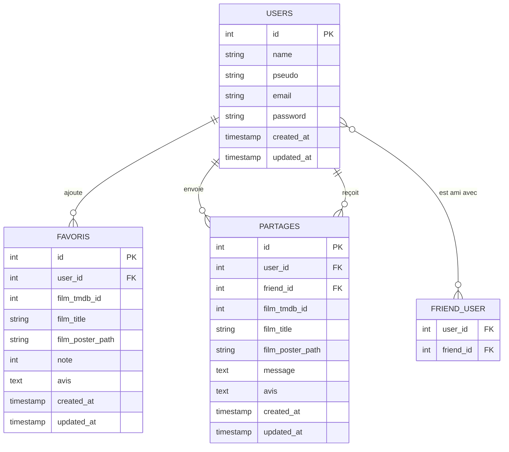

# 🎬 Mes Films Préférés

Application web de gestion et de partage de films, développée dans le cadre du **BTS SIO option SLAM** (E6 – Réalisation professionnelle).

> 🔗 **Application en production :** [mesfilmspreferes.olivier.portfoliobtssio66.fr](https://mesfilmspreferes.olivier.portfoliobtssio66.fr)

---

## 📌 Présentation

**Mes Films Préférés** permet à des utilisateurs inscrits de :
- 🔍 **Rechercher** des films via l'API TMDB (titre, genre, films populaires)
- ⭐ **Gérer une liste personnelle** de films avec notes (1 à 5 étoiles) et avis
- 👥 **Ajouter des amis** par email ou pseudo
- 📤 **Partager des films** avec un message personnalisé
- 👤 **Gérer son profil** et consulter ses statistiques

---

## 🗂️ Diagramme MCD (Modèle Conceptuel de Données)



---

## ⚙️ Stack technique

| Catégorie | Technologie |
|---|---|
| Backend | PHP 8.4 / Laravel 12 |
| Frontend | Blade, HTML5, CSS3, JavaScript |
| Base de données | MySQL |
| API externe | TMDB (The Movie Database) |
| Hébergement | o2switch |
| Versioning | Git / GitHub |

---

## 🏗️ Architecture MVC

```
app/
├── Http/
│   └── Controllers/
│       ├── AccueilController.php
│       ├── RechercherFilmController.php
│       ├── FavorisController.php
│       ├── AmisController.php
│       ├── PartageController.php
│       └── ProfilController.php
├── Models/
│   ├── User.php
│   ├── Favori.php
│   └── Partage.php
resources/views/
├── accueil.blade.php
├── auth/
│   ├── login.blade.php
│   └── register.blade.php
├── films/
│   ├── rechercher-film.blade.php
│   └── favoris.blade.php
├── amis.blade.php
├── partages.blade.php
└── profil.blade.php
```

---

## 🚀 Installation locale

### Prérequis
- PHP 8.4+
- Composer
- MySQL
- Node.js + npm

### Étapes

```bash
# 1. Cloner le dépôt
git clone https://github.com/Oliviez1/mesfilmspreferesE6.git
cd mesfilmspreferesE6/mesfilmspreferes

# 2. Installer les dépendances PHP
composer install

# 3. Installer les dépendances JS
npm install && npm run build

# 4. Configurer l'environnement
cp .env.example .env
php artisan key:generate

# 5. Configurer la base de données dans .env
DB_DATABASE=mesfilmspreferes
DB_USERNAME=root
DB_PASSWORD=

# 6. Ajouter la clé API TMDB dans .env
TMDB_API_KEY=votre_clé_api

# 7. Créer les tables
php artisan migrate

# 8. Lancer le serveur
php artisan serve
```

---

## 🔑 Configuration TMDB

1. Créer un compte gratuit sur [themoviedb.org](https://www.themoviedb.org/)
2. Aller dans **Paramètres → API** et générer une clé
3. Ajouter dans le fichier `.env` :
```env
TMDB_API_KEY=votre_clé_api_ici
```

---

## 📋 Fonctionnalités détaillées

### 🔐 Authentification
- Inscription avec email, pseudo et mot de passe (hashé bcrypt)
- Connexion / déconnexion sécurisée
- Pages protégées par middleware `auth`

### 🎬 Découvrir
- Affichage des films populaires au chargement via TMDB
- Recherche par titre
- Filtre par genre

### ⭐ Ma liste
- Ajout et suppression de films
- Note de 1 à 5 étoiles
- Avis textuel

### 👥 Amis
- Ajout d'un ami par email ou pseudo
- Suppression d'un ami
- Relation bidirectionnelle (table pivot `friend_user`)

### 📤 Partages
- Partager un film directement depuis la page Découvrir
- Message personnalisé à l'envoi
- Consultation des films reçus et envoyés

### 👤 Profil
- Modification du nom, pseudo et email
- Statistiques : nombre de films, notes, amis
- Liste des films notés

---

## 👨‍💻 Auteur

**ARBOUX Olivier** — BTS SIO 2ème année, option SLAM  
[GitHub](https://github.com/Oliviez1)
